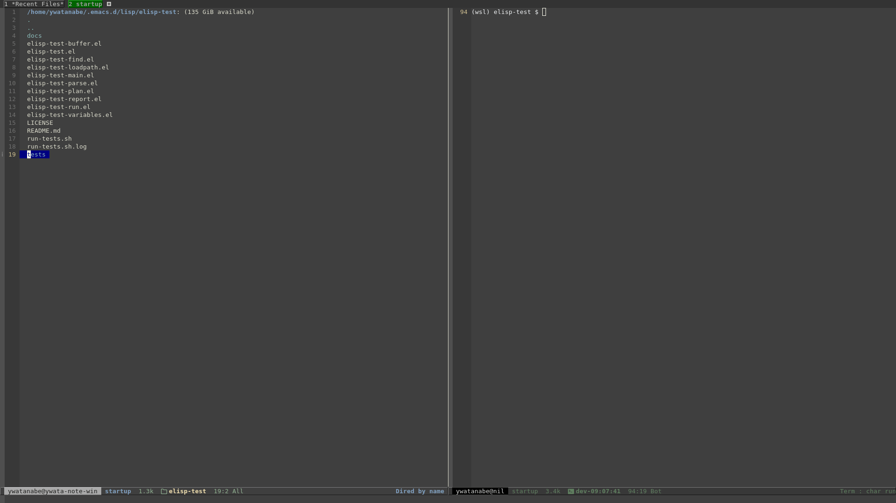

<!-- ---
!-- Timestamp: 2025-03-05 09:18:52
!-- Author: ywatanabe
!-- File: /home/ywatanabe/.emacs.d/lisp/elisp-test/README.md
!-- --- -->

# Elisp Test

[](https://github.com/ywatanabe1989/elisp-test/actions)

A testing framework for Emacs Lisp projects that integrates with ERT (Emacs Lisp Regression Testing).



## Example Test Reports
- [`./ELISP-TEST-REPORT-20250305-091305-100-PERCENT.org`](./ELISP-TEST-REPORT-20250305-091305-100-PERCENT.org)
- [`./tests/nested/ELISP-TEST-REPORT-20250305-091305-100-PERCENT.org`](./tests/nested/ELISP-TEST-REPORT-20250305-091305-100-PERCENT.org)

## Installation
1. Clone the repository:
```bash
git clone https://github.com/username/elisp-test.git ~/.emacs.d/lisp/elisp-test
```

2. Add to your init.el:
```elisp
(add-to-list 'load-path "~/.emacs.d/lisp/elisp-test")
(require 'elisp-test)
```

## Usage
#### Interactive Mode
1. Run tests on current buffer:
```elisp
(et-test)
```

2. Run tests on specific path (and child test files):
```elisp
(et-test) ; Run tests on current directory
(et-test "~/projects/my-elisp-project/test-example.el") ; Run tests on specific path
(et-test "~/projects/my-elisp-project/tests/") ; Run tests on child paths
;; In dired
;; Mark test files/directories with `m` -> `M-x et-test`
```

3. Running on multiple directories:
```elisp
;; Results are consolidated into a single report
(et-test '("~/path/to/tests1" "~/path/to/tests2"))

;; For dired mode: mark multiple directories, then run et-test
;; Each directory will generate its own report with consistent timestamps
```

#### Batch Mode
Create a `run-tests.el`:
```elisp
(setq ert-batch-print-level nil)
(setq ert-batch-print-length nil)
(load "~/.emacs.d/lisp/elisp-test/elisp-test.el")
(et-test "~/path/to/tests")
```

Run from command line:
```bash
emacs -Q --batch -l run-tests.el
```

## Configurations
#### Example Key Bindings
``` elisp
(global-set-key (kbd "C-c C-t") #'et-test)
```

#### Customizable Variables
- `et-timeout-sec`: Test timeout (default: 10s)
- `et-test-file-expressions`: Test file patterns
- `et-test-file-exclude-expressions`: Exclusion patterns
- `et-results-org-path`: Results file location
- `et-results-org-path-dired`: Results file location for dired-specific reports
- `et-buffer-name`: Test buffer name

## License
Yusuke Watanabe (ywatanabe@alumni.u-tokyo.ac.jp)

<!-- EOF -->